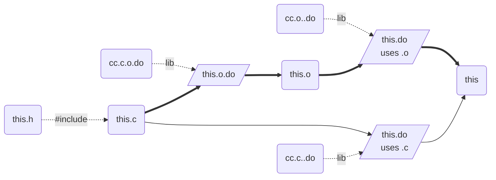

[flowchart](https://mermaid-js.github.io/mermaid/#/flowchart)

```mermaid
graph LR
	this.h(this.h)
	this.c(this.c)
	this.o(this.o)
	this(this)
	
	cc.c.o.do(cc.c.o.do)
	this.o.do[/this.o.do/]
	cc.o..do(cc.o..do)
	this-o.do[/this.do<br/>uses .o/]

	cc.c..do(cc.c..do)
	this-c.do[/this.do<br/>uses .c/]

	cc.o..do -. lib .-> this-o.do
	cc.c.o.do -. lib .-> this.o.do
	this.h -. #include .-> this.c ==> this.o.do ==> this.o ==> this-o.do ==> this
	this.c --> this-c.do --> this
	cc.c..do -. lib .-> this-c.do
```
